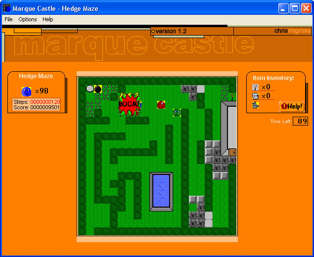



## Marque Castle 1\.2

### Description

The latest version of my complete top-view strategy/adventure game, Marque Castle.

Features seventeen progressively more challenging levels, co-operative multi-player strategy, some simple enemy AI, and tools for creating your own levels. Strategy involves spikes, locked blocks, lakes, alternating tiles, bombs, and two different kinds of enemies – all in race with the clock. Also, you can easily customize the skins that make up the game's graphics.

See how far you can get in the game! Please vote and leave your comments! Stay tuned for Marque Castle Redux, a remake of Marque Castle in VB.net, with an entirely new engine and revamped levels.
 
### More Info
 

             |
---                |---
**Submitted On**   |2003-01-05 09:05:20
**By**             |[Chris Ringrose](https://github.com/Planet-Source-Code/PSCIndex/blob/master/ByAuthor/chris-ringrose.md)
**Level**          |Intermediate
**User Rating**    |4.8 (24 globes from 5 users)
**Compatibility**  |VB 5\.0, VB 6\.0
**Category**       |[Games](https://github.com/Planet-Source-Code/PSCIndex/blob/master/ByCategory/games__1-38.md)
**World**          |[Visual Basic](https://github.com/Planet-Source-Code/PSCIndex/blob/master/ByWorld/visual-basic.md)
**Archive File**   |[Marque\_Cas152455152003\.zip](https://github.com/Planet-Source-Code/chris-ringrose-marque-castle-1-2__1-42206/archive/master.zip)

